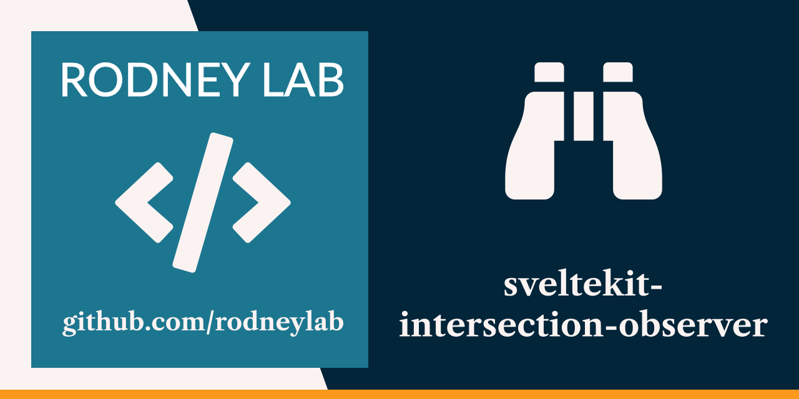

<p align="center">
  <a aria-label="Open Rodney Lab site" href="https://rodneylab.com" rel="nofollow noopener noreferrer">
    
  </a>
</p>
<h1 align="center">
  SvelteKit Intersection Observer
</h1>

# sveltekit-intersection-observer

[](https://open.vscode.dev/rodneylab/sveltekit-intersection-observer)

SvelteKit demo code for using the Intersection Observer to help track page views.. The code accompanies the <a aria-label="Open Rodney Lab blog post on tracking page views in Svelte Kit" href="https://rodneylab.com/tracking-page-views-sveltekit/">article on tracking page views in SvelteKit </a>. If you have any questions, please drop a comment at the bottom of that page.

## Building and previewing the site

If you're seeing this, you've probably already done this step. Congrats!

```bash
git clone https://github.com/rodneylab/sveltekit-intersection-observer.git sveltekit-intersection-observer
cd sveltekit-intersection-observer
pnpm install # or npm install
pnpm run dev
```

## Building

```bash
pnpm run build
```

> You can preview the built app with `pnpm run preview`, regardless of whether you installed an adapter. This should _not_ be used to serve your app in production.
